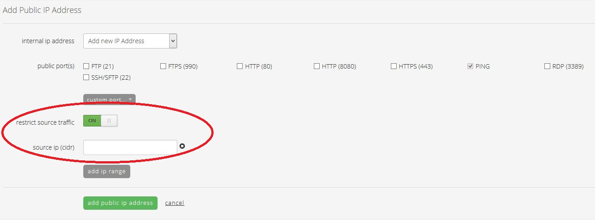

{{{
  "title": "Recommended Security Practices for Using CenturyLink Cloud",
  "date": "01-06-2015",
  "author": "Steve White",
  "attachments": [],
  "contentIsHTML": false
}}}

### Description (goal/purpose)
The purpose of this article is to provide some general recommended security practices for customers using CenturyLink Cloud. These practices are based on common scenarios we have seen in customer environment, but is not an exhaustive list of all possible security considerations and is not intended to replace having a proper security risk assessment performed on the customer environment.

### Audience
* All CenturyLink Cloud customers

### Impact
Failure to properly secure systems and applications that are exposed to the public network can result in the systems being compromised, leakage of proprietary data, etc. In some cases, a compromised machine can be used by remote attackers as part of a botnet to attack other systems across the Internet.

### Prerequisites
None

### Detailed Steps
1. Do not open SSH (port 22) or RDP (port 3389) to the public network. Customers wishing to manage their servers over SSH and RDP should use the provided software-based VPN or other private connection option such as Direct Connect, IPSec VPN, etc. More information about the VPN can be found in our knowledge base [here](https://www.ctl.io/knowledge-base/network/how-to-configure-client-vpn/).
2. Always set strong administrator passwords that are at least 12 characters long, include at least one lowercase letter, uppercase letter, number, and special character, and do not include dictionary words, even using common substitutions like "@" instead of "a".
3. When opening an application to the public network such as HTTP or HTTPS, only open the specific port(s) needed, do not open all ports, or large ranges of ports.
4. When building a new server or installing a new application onto a server, always run a patch update to install the latest operating system and application patches on the system.
5. Regularly apply patch updates to operating systems and applications.
6. If there is a business requirement such that you absolutely must open RDP or SSH to the public network, use the "restrict source traffic" feature to restrict the traffic to that port to authorized sources only. (See [How to Add Public IP to Virtual Machine](https://www.ctl.io/knowledge-base/network/how-to-add-public-ip-to-virtual-machine/) for more details.)

  
